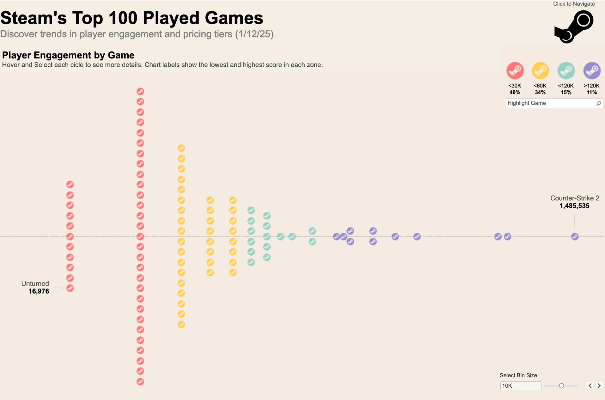

# 🎮 Steam's Top 100 Games Dashboard  

This repository contains a Tableau dashboard that analyzes the top 100 Steam games played today. The dashboard provides insights into:  
- **Player Distribution**: Split by current players.  
- **Price Range Analysis**: How game prices compare.  
- **Genre Insights**: Breakdown by game genres.  

  

## 📊 Tableau Dashboard  
Explore the interactive Tableau dashboard here: [Steam's Top 100 Dashboard]([<your-tableau-public-link>](https://public.tableau.com/views/STEAMTop100PlayedGamesMOM2025W3/STEM_TOP_100?:language=en-US&:sid=&:redirect=auth&:display_count=n&:origin=viz_share_link))  

---

## 📂 Repository Contents  
- Dataset containing game names, current players, prices, genres, and Steam links.  
- The Tableau workbook file for the dashboard.
- Snapshot of the dashboard.  

---
